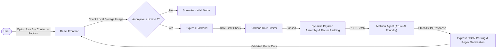
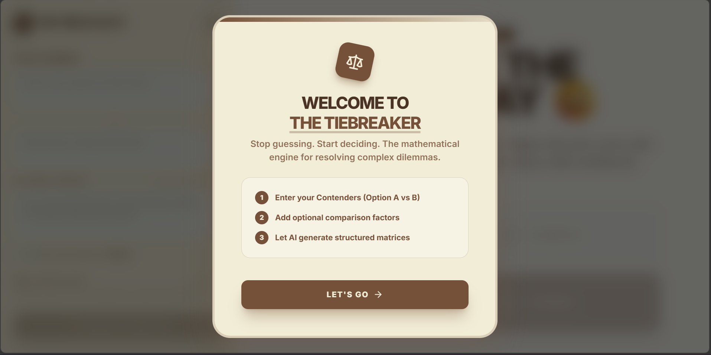
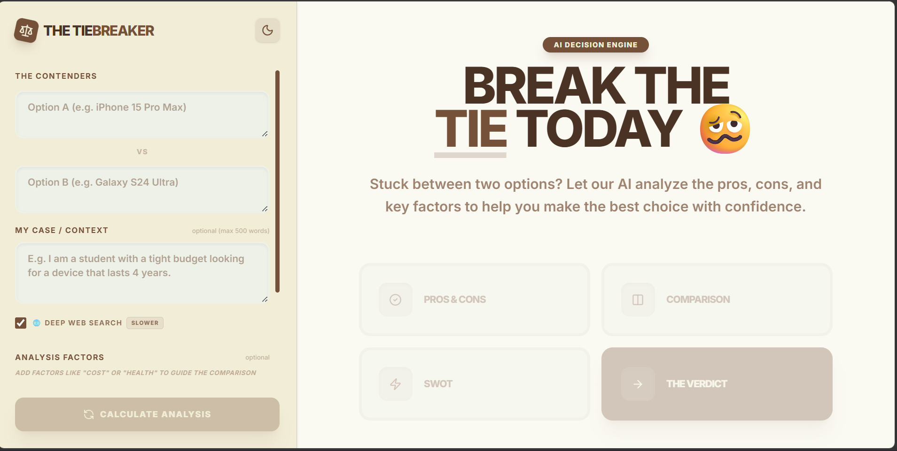
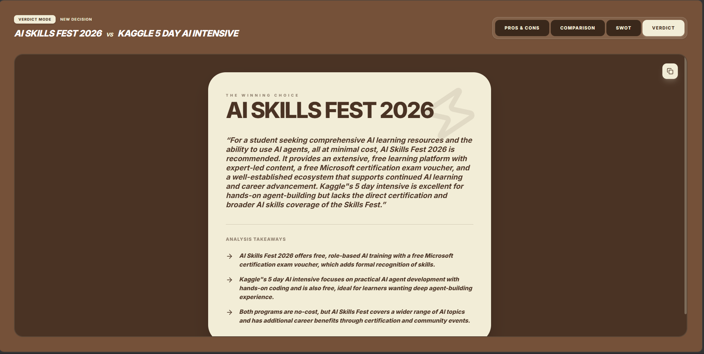

# 🧠 The TieBreaker

> **Stop guessing. Start deciding.** A deterministic AI decision engine that transforms ambiguous "A vs B" dilemmas into structured comparison matrices, multi-angle analysis, and context-aware verdicts.


---

## 🚀 Overview

### The Problem
When users ask general-purpose AI to choose between two options—for example, *“MacBook Air vs iPad Pro”*—the response is typically an open-ended, markdown-heavy wall of text concluding with *"it depends on your needs."* While comprehensive, it fails to deliver a structured, actionable decision framework.

### The Solution
**The TieBreaker** operates on the opposite philosophy: **deterministic structure over free-form AI conversation**. 

Instead of a chat interface, it enforces a strict backend execution pipeline. Users submit two contenders along with optional personal constraints and evaluation factors. The system processes the input through a schema-driven AI engine, rendering a multi-tab analytical dashboard featuring objective comparison matrices, SWOT profiles, and a definitive, context-grounded winner.

---

## 🏗️ System Architecture & Data Flow



### Staged Processing Pipeline
1. **Ingestion & Normalization:** Captures inputs, enforces length boundaries (`maxLength`), and normalizes strings.
2. **Deterministic Fallback Padding:** Analyzes requested factors and automatically injects universal baseline dimensions if data is sparse.
3. **Structured Orchestration:** Dispatches a structured schema instruction set via REST to the hosted Azure AI Agent.
4. **Sanitization Interceptor:** Sanitizes raw LLM output strings via RegEx, parses the JSON payload, and validates it against the expected UI schema before returning it to the client.

---

## 🤖 Architectural Decisions: Why Azure AI Foundry?

Building a structured data application around a probabilistic LLM requires strict behavioral guardrails. The TieBreaker rejects typical chat paradigms in favor of a production-style AI subsystem engineered for reliability.

* **Strict Contract Compliance:** Standard completions APIs are prone to markdown bleed and formatting hallucinations. Azure AI Foundry Agents allow us to lock down system-level constraints, ensuring the engine behaves like a structured API rather than a conversational chatbot.
* **Predictable Component Rendering:** The frontend relies entirely on matching array shapes and object keys to prevent UI layout shifts or broken table columns. By leveraging structured output expectations at the agent level, the application maintains absolute presentation stability.
* **Contextual Grounding:** It allows clean separation between system instructions, schema expectations, and dynamic user payloads, maximizing prompt execution accuracy.

---

## 🧠 Meet Melinda: The Decision Intelligence Engine

The backend brain of TieBreaker is **Melinda**, an isolated agent hosted on Azure AI Foundry. Her single responsibility is converting unstructured human dilemmas into a strictly typed data artifact.

### Expected JSON Output Contract
Every response must strictly match this schema layout to satisfy the frontend parser:

```json
{
  "entities": ["MacBook Air M3", "iPad Pro M4"],
  "analyticalReasoning": "Given the user's focus on heavy video editing and multitasking, the MacBook offers a true desktop OS while the iPad is limited by iPadOS workflows.",
  "factors": ["Usability", "Cost", "Performance", "Ecosystem"],
  "comparison": [
    {
      "optionName": "MacBook Air M3",
      "values": {
        "Usability": "Full macOS with desktop-class multitasking.",
        "Cost": "Starting at $1099, excellent value.",
        "Performance": "M3 chip handles 4K video editing effortlessly.",
        "Ecosystem": "Seamless integration with iOS devices."
      }
    },
    {
      "optionName": "iPad Pro M4",
      "values": {
        "Usability": "Touch-first iPadOS, limited multitasking.",
        "Cost": "Starting at $999, but requires $299 Magic Keyboard.",
        "Performance": "Incredibly fast M4, but bottlenecked by software.",
        "Ecosystem": "Excellent for Apple Pencil drawing and media consumption."
      }
    }
  ]
}
```

---

## 🧩 Technical Challenges Solved

### 1. Constraining LLM Output for Structured Interfaces
**Challenge:** LLMs often output leading/trailing markdown prose (e.g., ```json ... ```) or subtle structural errors that break `JSON.parse()`.
**Solution:** Implemented a robust Express backend sanitization interceptor utilizing regex matching patterns combined with catch-and-repair fallback logic to guarantee predictable frontend payload delivery.

### 2. Preserving UI Matrix Completeness (Mathematical Factor Padding)
**Challenge:** If a user provides only one comparison factor, standard comparisons fail or look broken in a multi-column data grid.
**Solution:** The Node.js layer computes the data deficit and dynamically injects universal baseline dimensions (e.g., *Usability*, *Cost*, *Performance*) to round out the grid, ensuring a full dashboard presentation regardless of input depth.

### 3. Context Cascading & Hallucination Prevention
**Challenge:** Generating final verdicts directly from a raw prompt can result in the AI introducing new, unverified facts not covered in the original comparison blocks.
**Solution:** Implemented an architectural pipeline where the final verdict layer strictly harvests and consumes previously established matrices from the payload, preventing the model from generating disconnected assumptions.

### 4. Cache-Aware Usage Gating
**Challenge:** Users were getting blocked by the "Auth Wall" usage limit when simply trying to re-read analyses they had already generated.
**Solution:** Built an intelligent server/client LRU cache that evaluates memory state *before* pinging the rate limiter. This decoupling guarantees users can endlessly toggle through their historical session tabs without triggering new API deductions.

---

## ✨ Key Product Features

* **No Chatbot UX:** Replaces conversational fatigue with form-driven data dashboard components.
* **"My Case" Context Engine:** Processes up to 500 words of specific lifestyle constraints (e.g., budget, travel metrics) to derive hyper-personalized choices rather than generic data sheets.
* **Multi-Lens Analytical Views:** Splits a single resolution workflow into clear, distinct visual tabs: *Pros & Cons*, *Comparison Matrix*, *SWOT Analysis*, and *Final Verdict*.
* **Live Web Grounding (Optional Toggle):** Supplements the static agent knowledge base with external search execution to account for volatile real-time variables like pricing updates.
* **Zero-Scroll Mobile Engine:** Fluid side-by-side data grids powered by sub-millimeter padding and a fixed micro-toolbar, ensuring a premium native-app feel on mobile devices.
* **Lightning Cache:** In-memory LRU Maps prevent duplicate AI API requests, granting instantaneous cross-tab rendering.

---

## 📸 App Previews

### WelcomeModal

*An onboarding modal introducing users to the structured decision framework.*

### Tiebreaker Setup

*Dual-input fields alongside the 500-word constraint personalized context input engine.*

### Theme Adaptability
.png)
*Full dark/light structural synchronization across all customized components.*

### The Final Verdict

*Definitive conclusion screen driven strictly by context-cascaded data blocks.*

### Premium Gating

*A local storage-tracked client block prompting account initialization after 3 free inquiries.*

---

## 🔒 Security, Guardrails & Reliability

| Identified Risk | Mitigation Vector | Implementation Layer |
| :--- | :--- | :--- |
| **Excessive API Compute Costs** | String length boundaries & 500-word payload enforcement | Frontend Input & Express Router |
| **Rate Limit / API Exhaustion** | Cluster rate limiting via `express-rate-limit` middleware | Node.js Server Ingestion |
| **Broken UI / Layout Collapse** | Regex structural parsing interceptors & schema key validations | Express Response Pipe |
| **Stale Evaluation Data** | Optional dynamic Live Web Grounding routing toggle | Azure Agent Integration |

---

## ⚙️ Technology Stack

* **Frontend:** React 19, Vite, Tailwind CSS v4, Framer Motion
* **Backend Runtime:** Node.js, Express
* **AI Ecosystem:** Azure AI Foundry, `@azure/identity` (`AzureCliCredential`)
* **Languages:** TypeScript, JavaScript (ES6+)
* **Testing Engine:** Vitest, automated execution verification suites

---

## 🧪 Test Coverage

The codebase includes an automated suite proving behavioral state persistence, interface stability, and error mitigation vectors.

```bash
✓ src/tests/ThemeToggle.test.tsx (1)
✓ src/tests/UsageWallGate.test.tsx (2)
✓ src/tests/ApiResponseValidation.test.tsx (4)
✓ src/tests/UIComponentRender.test.tsx (2)

Test Files  5 passed (5)
Tests       9 passed (9)
```


---

## 📂 Project Structure

```text
root/
├── server.js                  # Express API, REST orchestration, JSON sanitization interceptors
├── TieBreaker_Agent_Prompt.md # Isolated system persona prompt & production JSON schemas
├── package.json               # Development scripts (concurrent execution, vite, tailwind)
├── src/
│   ├── App.tsx                # Context cascading, global application state, and cache routing
│   ├── main.tsx               # React application mounting node
│   ├── index.css              # PostCSS Tailwind architecture configurations
│   └── lib/
│       └── utils.ts           # Class merging utilities
├── Pictures/                  # Architectural documentation images
├── .env.example               # Environment template keys
└── README.md                  # System core engineering documentation
```

---

## 🚀 Quick Start

### 1. Clone & Navigate
```bash
git clone https://github.com/Ahtesham-Latif/Tie-Breaker-App.git
cd Tie-Breaker-App
```

### 2. Provision Dependencies
```bash
npm install
```

### 3. Environment Environment Variables
Instantiate a `.env` deployment file inside the system root:
```env
FOUNDRY_ENDPOINT=https://your-agent.services.ai.azure.com/openai/deployments/gpt-4o/chat/completions?api-version=2025-05-15-preview
Melinda_Agent=your-agent-identifier
```

### 4. Authenticate Infrastructure
```bash
az login
```

### 5. Launch Local Dev Node
Execute frontend and backend tasks concurrently:
```bash
npm run dev:full
```

---

## 🏆 Google Gemini CLI Workflows

The **Google Gemini CLI** was utilized as an engineering accelerator throughout development to bootstrap system components and refine backend safety configurations.

### Key Workflows Assisted:
* Creating early Node.js express proxy routes and integration patterns.
* Implementing strict regex sanitizers to parse corrupted JSON output blocks cleanly.
* Structuring automated UI and integration testing patterns inside Vitest.

### Verified Badges
**Build AI Agents with Gemini**
[](https://developers.google.com/profile/badges/events/cloud/five-day-ai-agents)

---

## 🔮 Roadmap & Next Milestones
* Integrate **Supabase** for full user authentication and secure multi-tenant data structures.
* Implement persistent cloud database storage for historical evaluation tracking.
* Develop a backend layout engine to support **PDF Export** for completed decision matrices.
* Introduce cryptographically unique shareable links for cross-user scenario exploration.

---

## 📄 License

Distributed under the MIT License.

---

## 👨‍💻 Author

**Ahtesham Latif**  
*Business & IT Scholar — University of the Punjab (IBIT)*  
[LinkedIn](https://www.linkedin.com/in/ahtesham-latif) | [Google Developer Profile](https://me.developers.google.com/u/me)  

*"Turning subjective dilemmas into objective, fact-driven choices through deterministic software architecture."*