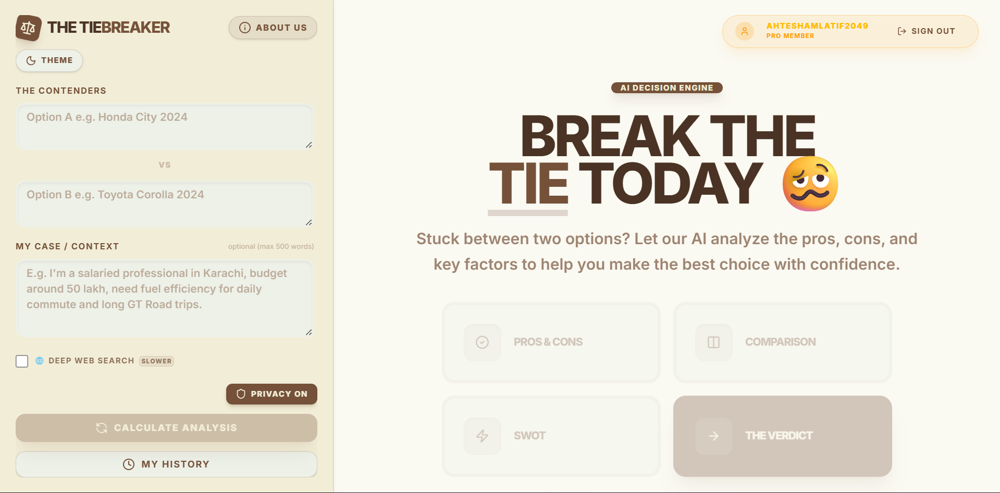
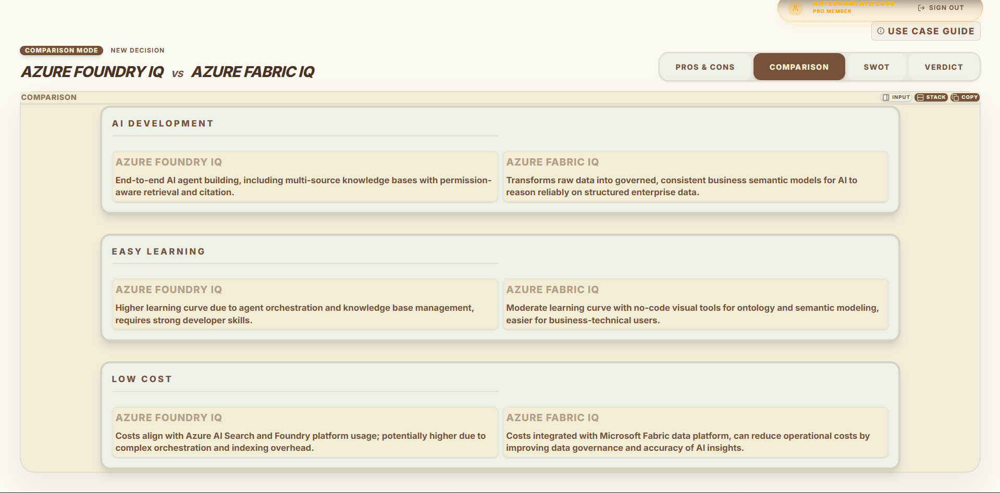
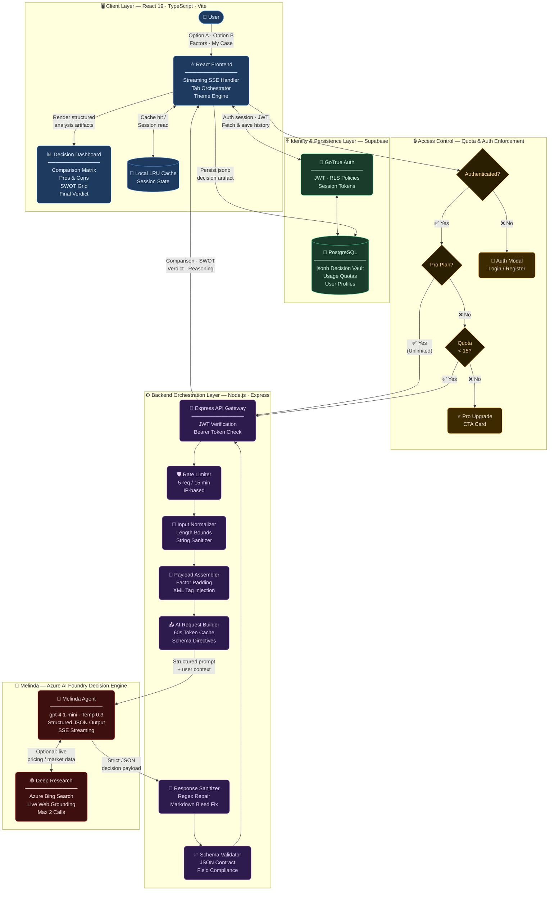
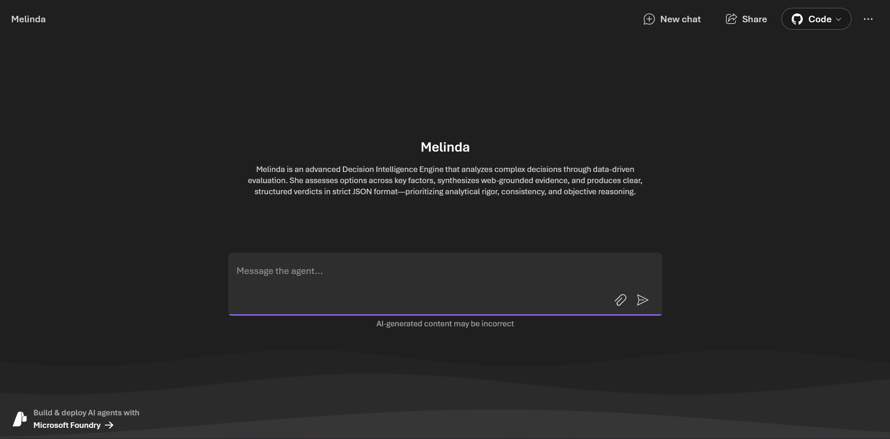
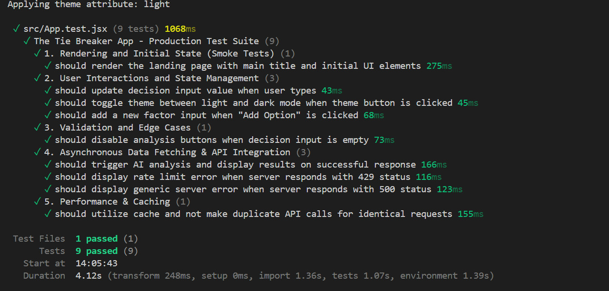

# 🧠 The TieBreaker
[](https://github.com/Ahtesham-Latif/Tie-Breaker-App/actions/workflows/main_tie-breaker.yml)

> **Stop guessing. Start deciding.**  
> *A deterministic AI decision engine that transforms ambiguous "A vs B" dilemmas into structured comparison matrices, multi-angle analysis, and context-aware verdicts.*

> 🔗 **[Try TieBreaker Live](https://tie-breaker-v2-avdmcehxfef8caeh.centralus-01.azurewebsites.net/)** 
> ⭐ **[Support on Product Hunt](https://www.producthunt.com/products/credible-labs)**
---
[](https://www.producthunt.com/products/credible-labs)

>


---

## 🚀 Overview: Why I Built This

We've all been there. You ask a general-purpose AI to help you choose between two things—say, *“MBBS vs CA”*—and you receive a massive, rambling wall of text that concludes with the incredibly unhelpful: *"It depends on your needs."* 

While technically accurate, it fails to deliver what we actually need: **a structured, actionable decision framework.**

**The TieBreaker** was built with a different, perhaps humbler philosophy: **deterministic structure over free-form AI conversation**. I didn't build a chat interface; I built a strict backend execution pipeline. I believe AI shouldn't just talk to you—it should organize your thoughts so *you* can make the final call.

Every dilemma is transformed into a structured decision artifact:
* ⚖️ **Objective Comparison Matrices**
* 👍 **Fact-based Pros & Cons**
* 🎯 **SWOT Profiles**
* 🏆 **Final Verdicts** tailored exactly to your personal context

### 📺 Watch the User Manual Guide
[](https://youtu.be/m__IZkOf2AU)
> *Click the image above to watch a complete walkthrough of The TieBreaker's features and decision intelligence engine!*

## 📸 Screenshots

### Decision Engine


### Comparison Matrix  


### Final Verdict


---

## ⚡ At a Glance
> **Sub-second TTFB • Live Web Grounding • Zero Layout Shifts**

* 🚀 **Real-Time SSE Streaming & Partial JSON:** Bypasses standard SDKs for raw `text/event-stream` processing, rendering analysis matrices live before the AI even finishes thinking!
* 🧠 **Azure AI Engine:** Powered by `gpt-4.1-mini` for ultra-low latency execution.
* 🌍 **Live Deep Research:** Autonomously queries Bing to override stale AI assumptions.
* 🗄️ **Supabase Vault:** Non-destructive `jsonb` persistence with instant, zero-latency retrieval.
* 🛡️ **Bulletproof Formatting:** Strict regex sanitization guarantees the React UI never breaks.

---

## 💡 When to Use It

The TieBreaker shines when you are navigating high-stakes dilemmas that require objective clarity and personalized context. Instead of generic "pros and cons," you provide the engine with specific constraints.

**Example 1: Career Architecture**
* **Dilemma:** *Build AI products vs. Become an AI researcher*
* **Factors Evaluated:** Personal fulfillment, Financial upside, Daily work satisfaction, Skill compounding, Long-term impact.
* **Your Context (My Case):** "I am a solo builder from Pakistan. I enjoy turning ideas into real products that people use. I have already built TieBreaker and several portfolio projects, and my long-term dream is to build a billion-dollar AI company inspired by products, not academic research. However, I also love learning how AI works deeply and worry that focusing on products may stop me from reaching frontier AI expertise."

**Example 2: Enterprise Infrastructure**
* **Dilemma:** *Stripe vs. PayPal for a Global SaaS*
* **Factors Evaluated:** Setup burden, Monthly cost, Cross-border payment gateways, Subscription management.
* **Your Context (My Case):** "I am launching an AI-powered SaaS aimed at B2B clients in the US and Europe, but my legal entity is based in a developing market. I need a solution that minimizes cross-border transaction fees while supporting seamless recurring billing APIs."

*Note: The TieBreaker is a deterministic logic engine, not a crystal ball. It thrives on factual comparisons and strategic analysis anchored in your specific reality.*

---

## 🛠️ How to Use It

Getting a definitive answer is a simple 3-step process:

1. **Enter Your Options:** Tell the engine exactly what you are comparing (e.g., Option A vs Option B).
2. **Add Your Factors (Optional):** Tell the engine *how* to judge them (e.g., Cost, Durability, Customer Support). If you leave this blank, the engine will automatically select the best factors for you.
3. **Plead "Your Case" (Member Only):** In 500 characters or less, tell the AI *who you are*. ("I'm a broke college student who needs a laptop for video editing..."). This completely personalizes the Final Verdict. You must create a free account to unlock this engine!

*(For a full breakdown of the UI, check out my newly added [User Manual](USER_MANUAL.md) or click the **About Us** button in the app to meet the creator!)*

---

## 🏗️ Architecture



### Staged Processing Pipeline
1. **Ingestion:** Enforces `maxLength` bounds and normalizes input strings.
2. **Padding:** Auto-injects universal baseline dimensions if user factors are sparse.
3. **Orchestration:** Dispatches strict schemas to Azure, utilizing a **60-second in-memory token cache** to drop auth overhead.
4. **SSE Streaming & Partial JSON Parsing:** Processes raw `text/event-stream` chunks, dynamically stitching and rendering incomplete JSON fragments live on the UI so users watch the matrices build in real-time.
5. **Sanitization:** Repairs markdown bleed, validates JSON schemas, and intercepts Azure `ERR-04-SAFETY` filters.
6. **Persistence:** Saves the exact `jsonb` artifact into Supabase PostgreSQL for zero-latency historical retrieval.

---

## 🗄️ Database Schema

For developers looking to clone and run TieBreaker locally, I've included a [schema.sql](schema.sql) file containing the exact database structure. 

The application uses three primary tables in Supabase:
* **`profiles`**: Extends the built-in `auth.users` table. Stores user demographics (age, profession), account features (`plan` type, `ties_count` limits), and the `privacy_mode` flag.
* **`decisions`**: The core AI artifact vault. Stores the original `query` and `factors`, alongside the structured JSON output generated by the AI (`comparison_data`, `pros_cons_data`, etc.). Includes an `is_hidden` soft-delete mechanism.
* **`reviews`**: A feedback loop table capturing Net Promoter Scores (`nps`) and qualitative text feedback (`loved`, `ease`, `future`).

*Note: Be sure to enable Row Level Security (RLS) on these tables after running the schema to secure user data.*

---

## 🤖 Why Azure AI Foundry Agents?

Melinda was engineered as an Azure AI Foundry Agent instead of a standard completion endpoint to enforce strict execution constraints over a probabilistic model. 

The TieBreaker relies heavily on:
* **Deep Research Grounding:** Configurable Web Search tool execution (with strict 2-call runtime limits enforced in the prompt) ensures Melinda evaluates current market prices without tanking performance.
* **Low Volatility (0.3 Temperature):** A strict `0.3` temperature setting prevents hallucinated product specifications, ensuring objective and repeatable data artifacts.
* **Enterprise Guardrails:** Azure content safety filters ensure that inappropriate or malformed requests are categorically blocked before compute resources are wasted or bad data enters the Supabase ecosystem.
* **Schema Enforced Output:** Standard conversational APIs are prone to markdown bleed. By streaming text directly into my custom regex extractors and parsing the result via a robust `MarkdownText` layer, I guarantee the React frontend never encounters a layout shift or broken table—even if factors go missing or casing mismatches.

---

## 🧠 Meet Melinda: The Decision Intelligence Engine



The backend cognitive engine of TieBreaker is **Melinda**, a specialized decision agent hosted on Azure AI Foundry. Rather than functioning as an open-ended conversationalist, Melinda operates as a strict analytical compiler—transforming ambiguous, emotionally charged dilemmas into objective, strictly-typed data artifacts.

### Engine Specifications & Tooling
* **Core Model:** Powered by Azure's `gpt-4.1-mini` (or equivalent ultra-fast deployments). I specifically leverage low-latency mini models without internal reasoning loops to achieve sub-second TTFB (Time to First Byte) while preserving high-tier logical structuring.
* **Grounding Integration:** Equipped with the **Azure Bing Web Search Tool**. When Deep Research is enabled, Melinda autonomously queries the live web to anchor her analysis in current pricing, market realities, and factual specs, completely overriding stale pre-trained assumptions.
* **Context Injection:** She receives layered prompt configurations dynamically assembled by the Express backend. This includes strict XML boundaries around user inputs, historical session memory (ensuring sequential tabs build upon, rather than repeat, past insights), and explicit schema directives.

### Execution Role
Melinda's execution pipeline is entirely silent. She does not interact directly with the user. Instead, she continuously evaluates the dilemma against the user's specific context constraints and requested analysis mode (Comparison, Pros & Cons, SWOT, Verdict), outputting a highly constrained JSON buffer that the backend intercepts and validates.

### Expected JSON Output Contract
Every response must strictly match this schema layout to satisfy the frontend parser:

```json
{
  "entities": ["Build AI products", "Become an AI researcher"],
  "analyticalReasoning": "Given the user's focus on tangible product development, their geographical constraints (solo builder in Pakistan), and their timeline, the financial and impact realities heavily favor immediate product shipping over a multi-year academic diversion...",
  "factors": [
    "Personal fulfillment",
    "Financial upside",
    "Daily work satisfaction",
    "Skill compounding",
    "Long-term impact"
  ],
  "recommendation": "Commit entirely to building AI products. The frontier of applied AI is moving faster than academia, and building aligns perfectly with your proven track record and billion-dollar ambition.",
  "bulletPoints": [
    "You already possess the builder's momentum; pivoting to research would stall this trajectory.",
    "Billion-dollar outcomes in AI are increasingly driven by rapid product iteration, not just base-model research.",
    "Your anxiety about 'frontier expertise' can be mitigated by reading papers while you build, rather than pausing to publish them."
  ]
}
```

---

## 🎯 Key Features

### 🗄️ Cloud Persistence & The Supabase Vault
The TieBreaker isn't just a temporary calculator; it acts as a long-term, cryptographic journal of your strategic pivots. This is achieved through my deep integration with **Supabase PostgreSQL**.

* **What I Store:** Every time you calculate an analysis, the engine securely stores both your constraints (`option_a`, `option_b`, `factors`, `my_case`) and the compiled data artifacts generated by Melinda (`comparison_data`, `pros_cons_data`, `swot_data`, `verdict_data`). 
* **JSONB Column Architecture:** Rather than spawning new database rows every time you click a different tab, I utilize advanced PostgreSQL `jsonb` columns. This allows the Node backend to perform non-destructive, incremental partial updates to a single dilemma record as you explore different lenses.
* **Ironclad Privacy (RLS):** Your strategic decisions—whether they are confidential business pivots or personal life choices—are locked down via Supabase Row Level Security (RLS). Database policies strictly enforce that users can only `SELECT`, `UPDATE`, or `INSERT` rows tied to their specific authenticated UUID.
* **Instant Retrieval:** Because the exact JSON artifacts are preserved in the vault, clicking a past decision in your History Sidebar completely bypasses the Azure AI layer. The React frontend instantly pulls the `jsonb` payload and re-renders the exact matrices you generated days or months ago with zero latency.

### AI Decision Engine
* **No Chatbot UX:** Form-driven data dashboard components.
* **"My Case" Context Engine:** Personalized analysis tailored to 500-word user constraints.
* **Multi-Lens Analytical Views:** Pros & Cons, Comparison Matrices, SWOT, and Final Verdicts.
* **Background Extraction:** The backend performs silent JSON evaluation and formatting; the frontend never displays raw reasoning or "AI thinking" scratchpads.

### 🧠 Intelligent Cache Orchestration
* **Local LRU Cache:** Instantly returns previously generated tabs during an active session.
* **Supabase Pre-population:** History clicks fetch the exact `jsonb` payload to pre-populate the local cache, preventing blank screens.
* **Case-Insensitive Fallback:** `.ilike()` DB queries prevent users from burning AI quota on slightly miscapitalized identical decisions.
* **Smart Auto-Selection:** History links auto-scan the payload to land the user on the first valid, non-empty tab.

### Interface Design
* **Real-time SSE Streaming:** Dynamically reacts to backend streams, parsing incomplete JSON on the fly to build tables and logic live before your eyes, entirely removing static loading screens.
* **Premium Fluid AI Orb & Domain-Aware Quotes:** An Apple/OpenAI-style continuous progress animation pairs with an intelligent text parser that feeds curated, domain-specific quotes (Tech, Business, Career, etc.) dynamically based on your `My Case` constraints while you wait.
* **Native Desktop Scrolling:** Flawlessly transitions between side-by-side data grids and vertical stacked views, leveraging native window scrolling for an incredibly smooth experience across both desktop trackpads and mobile devices.
* **Extreme Zoom Resilience:** Employs a pure mathematics layout engine with viewport-relative typography clamping (`clamp()`), flex-wrapping, and an intelligent `data-zoom` hook that dynamically adjusts structural elements—ensuring perfect readability from 25% out to 500% zoom.
* **Mobile-First Accessibility:** Minimalist icon-only mobile buttons and edge-handles gracefully expand to reveal descriptive labels upon interaction, keeping the UI perfectly clean without sacrificing usability.
* **Theme Adaptability:** Full Dark/Light structural synchronization.

### UX Messaging Architecture & Quotas
* **Strict Quota Enforcement:** Protects backend resources by requiring authentication for any generation, and locking Free Logged-In users at 15 generations before prompting a seamless upgrade flow.
* **Pro Tier Features:** Upon claiming the Pro Tier, users unlock a golden profile badge, unlimited decisions, the ability to permanently delete history, and an exclusive **Privacy Mode (Ghost Mode)** that saves decisions to the DB but completely hides them from the UI.
* **6-Question Feedback Funnel:** Authenticated users who engage heavily with the app are greeted with a beautiful, 6-question survey matrix designed to capture NPS, core use-cases, and roadmap requests directly into the database.
* **Emotionally Intelligent Feedback:** Rate limits, Azure quota hits, and Guest Auth Walls trigger premium, reassuring messaging layers—not raw markdown.
* **Zero Technical Bleed:** Backend errors and streaming timeouts (`ERR-TIMEOUT`, `ERR-06`) are elegantly abstracted into actionable UI states.

### 🔎 Enterprise SEO Architecture
* **Inline JSON-LD Validation:** Structured schema markup natively embedded for zero-dependency semantic search processing.
* **Dynamic Open Graph & Twitter Cards:** Authentic, dimension-perfect UI assets generated natively for premium social sharing previews.
* **Intelligent Web Crawl Infrastructure:** Fully structured `robots.txt` and priority-weighted `sitemap.xml` mapping.

---

## 🔒 Security & Reliability

| Concern | Protection | Implementation Layer |
| --- | --- | --- |
| **Excessive API Compute Costs** | String length boundaries & 500-word payload enforcement | Frontend Input & Express Router |
| **Rate Limit / API Exhaustion** | Cluster rate limiting via `express-rate-limit` middleware | Node.js Server Ingestion |
| **Anonymous Spam** | Authentication strictly required before API gateway processing | Node.js API Gateway |
| **Prompt Injection** | Hardcoded XML boundaries (`<decision>`, `<user_context>`) with strict Agent execution overrides | AI Orchestration Layer |
| **Free-Tier Abuse** | Mathematical JWT verification checking `ties_count` via Supabase directly at the API layer | Backend Authentication |
| **Cache Corruption** | Non-destructive JSON partial updates prevent wiping previous decision factors | Database State Manager |

### Advanced API Defenses
* **JWT Enforced Execution:** The `/api/analyze` endpoint strictly requires a Supabase Bearer token—eliminating frontend-bypass vulnerabilities.
* **Semantic Prompt Isolation:** User strings are locked inside unexecutable XML tags (`<decision>`, `<user_context>`) to neutralize prompt injection.
* **Safe String Parsing:** Right-to-left `.lastIndexOf(' vs ')` safely parses history strings, preventing crashes when options naturally contain the delimiter.

### Rate Limiting & Cooldowns
* **Server-Side Throttle:** Hard cap of 5 requests per IP every 15 minutes.
* **Frontend Cooldowns:** Strict 10-second penalty blocks on API failures (Quota hits, Rate Limits) with evaluated error priorities.

### Validation & Resiliency Checks
* **Stream Extraction:** Regex parsers intercept and repair markdown bleed directly from the SSE buffer.
* **Schema Contracts:** Express dynamically injects missing matrix rows to ensure payload compliance before hitting React.
* **Universal UI Fallbacks:** `MarkdownText` layer prevents primitive `undefined` crashes when the AI drops a field.
* **Flexible Factor Mapping:** Case-insensitive object matching and array index fallbacks secure the UI against AI capitalization shifts.

---


## ⚙️ Technology Stack

| Layer | Technology |
| --- | --- |
| **Frontend** | React 19, Vite, Tailwind CSS v4, Framer Motion |
| **Backend** | Node.js, Express |
| **Database & Auth**| Supabase (PostgreSQL, GoTrue Auth) |
| **AI Platform** | Azure AI Foundry, `@azure/identity` |
| **Language** | TypeScript |
| **Testing** | Vitest |

---

## 📂 Project Structure

```text
📦 Tie-Breaker-App
 ┣ 📂 public/              # Static assets & icons
 ┣ 📂 src/
 ┃ ┣ 📂 __tests__/         # Modular AAA Vitest suites (Smoke, Integration, etc.)
 ┃ ┣ 📂 components/        # Isolated React UI pieces
 ┃ ┃ ┣ 📂 modals/          # Welcome and Auth wall overlays
 ┃ ┃ ┗ 📂 ui/              # Buttons, inputs, and layout wrappers
 ┃ ┣ 📂 context/           # Global React Context (AuthProvider)
 ┃ ┣ 📂 db/                # Supabase PostgreSQL connectivity
 ┃ ┣ 📂 hooks/             # Custom React lifecycle management
 ┃ ┣ 📂 lib/               # Shared utilities and parsers
 ┃ ┣ 📜 App.tsx            # Main application orchestrator & streaming logic
 ┃ ┣ 📜 index.css          # Tailwind v4 root
 ┃ ┗ 📜 main.tsx           # React DOM mounting
 ┣ 📜 server.js            # Node/Express API Gateway & rate limiting
 ┣ 📜 vite.config.ts       # Bundler configuration
 ┣ 📜 vitest.config.ts     # Test runner configuration
 ┗ 📜 package.json         # Dependencies & scripts
```

---

## 🧪 Testing & Quality Assurance

The TieBreaker features a completely modular, **AAA (Arrange-Act-Assert)** test suite powered by Vitest and React Testing Library. By breaking down the monolithic architecture into isolated domains, I guarantee bulletproof resiliency across the entire application lifecycle.

### Test Suite Architecture
The test suite is divided into 5 focused domains located in `src/__tests__/`:

1. **`smoke.test.jsx`** - Validates foundational rendering, zero-crash initialization, and DOM integrity.
2. **`interaction.test.jsx`** - Ensures React state handlers seamlessly track complex user inputs, form mutations, and theme toggling.
3. **`validation.test.jsx`** - Guards against malformed inputs by enforcing edge-case boundary checks (e.g., disabling submission when factors are empty).
4. **`integration.test.jsx`** - Orchestrates mocked API fetch streams, verifying that JSON payloads are correctly extracted, validated, and mapped into the UI. Also enforces correct error messaging for server timeouts/500 codes.
5. **`performance.test.jsx`** - Tests local `localStorage` cache hits to ensure identical requests resolve with zero network overhead.

### Test Results


```text
 ✓ src/App.test.jsx (1 test)
 ✓ src/__tests__/smoke.test.jsx (1 test)
 ✓ src/__tests__/validation.test.jsx (1 test)
 ✓ src/__tests__/interaction.test.jsx (3 tests)
 ✓ src/__tests__/performance.test.jsx (1 test)
 ✓ src/__tests__/integration.test.jsx (2 tests)

 Test Files  6 passed (6)
      Tests  9 passed (9)
   Duration  7.06s
```

---

## 🚀 Quick Start

### 1. Clone & Navigate
```bash
git clone https://github.com/Ahtesham-Latif/Tie-Breaker-App.git
cd Tie-Breaker-App
```

### 2. Install Dependencies
```bash
npm install
```

### 3. Configure Environment Variables
```bash
cp .env.example .env
```
Populate `.env` with:
```env
FOUNDRY_ENDPOINT=https://your-agent.services.ai.azure.com/openai/deployments/gpt-4.1-mini/chat/completions?api-version=2025-05-15-preview
Melinda_Agent=your-agent-identifier
VITE_SUPABASE_URL=your-supabase-url
VITE_SUPABASE_ANON_KEY=your-supabase-anon-key
```

### 4. Database Setup (Supabase)
For the database structure and table initialization, please refer to the [schema.sql](schema.sql) file. You can run its contents in your Supabase SQL Editor.

### 5. Authenticate Infrastructure
```bash
az login
```

### 6. Launch Local Dev Node
Execute frontend and backend tasks concurrently:
```bash
npm run dev:full
```

---

## 🏆 Google Gemini CLI Workflows

The **Google Gemini CLI** was utilized as an engineering accelerator throughout development to bootstrap system components and refine backend safety configurations.

### Contributions
* Structuring the React interface and Zero-Scroll mobile layout
* Integrating Supabase authentication and PostgreSQL history tracking
* Implementing strict regex sanitizers to parse corrupted JSON output blocks
* Structuring automated UI and integration testing patterns inside Vitest
* Building modular, strictly validated **Agent Skills** natively into `.agents/` for repeatable agentic execution (e.g., SEO checklists, Database mappings).

### Verified Badges
**Build AI Agents with Gemini**
[](https://developers.google.com/profile/badges/events/cloud/five-day-ai-agents)

---

## 🔮 Future Enhancements
* Develop a backend layout engine to support **PDF Export** for completed decision matrices.
* Introduce cryptographically unique shareable links for cross-user scenario exploration.
* Build advanced surveying modules to capture user feedback on engine accuracy.

---

## 🤝 Contributing

Please see my [CONTRIBUTING.md](CONTRIBUTING.md) file for more details.

### Good first issues
- Add new local market facts to the system prompt (R4)
- Improve zoom resilience at non-standard DPI settings
- Add new quote domains to Quotes.txt
- Write additional Vitest test cases

### What I don't accept
- Changes to the Melinda system prompt without test evidence
- UI changes that break the 100% zoom layout
- Dependencies that increase bundle size > 10kb

---

## 📄 License
This project is licensed under the [MIT License](LICENSE).

---

## 👨‍💻 Author

**Ahtesham Latif**  
*Business & IT Scholar — University of the Punjab (IBIT)*  
[LinkedIn](https://www.linkedin.com/in/ahtesham-latif) | [Google Developer Profile](https://me.developers.google.com/u/me)  

*"Turning subjective dilemmas into objective, fact-driven choices through deterministic software architecture."*