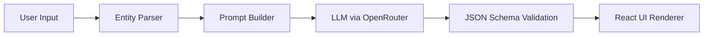

# 🧠 THE TIEBREAKER

A production-ready AI decision intelligence engine built to help users resolve complex dilemmas using structured reasoning. The system leverages LLM-powered analysis to generate Pros & Cons, Side-by-Side Comparisons, SWOT breakdowns, and final verdicts with clear, structured outputs.

[](https://reactjs.org/)
[](https://www.typescriptlang.org/)
[](https://vitejs.dev/)
[](https://azure.microsoft.com/)
[](https://openrouter.ai/)

> **⚠️ Deployment Notice:** Azure deployment is currently paused as the free tier limit has been reached. The CI/CD pipeline remains intact, and I am currently exploring free-tier alternatives (Railway, Render, Vercel) for redeployment.

**🔗 Live Demo:** [Experience TieBreaker](https://tie-breaker-fjgrfwbkakakgham.canadacentral-01.azurewebsites.net/)

---

## 📸 Previews

.png)
--

# Verdict


AI-powered decision engine that supports:

- Simple comparisons (e.g. Python or C++)
- You can add supporting factors how , what factors you want in analysis

Outputs include:
- Pros & Cons analysis
- Side-by-side structured comparisons
- SWOT analysis (Strengths, Weaknesses, Opportunities, Threats)
- Final AI-generated verdict

---

## 🚀 Overview

TieBreaker is designed as a **decision intelligence system**, not just a chatbot UI. It transforms unstructured user dilemmas into structured analytical outputs using LLMs and schema-enforced responses.

**Key User Features:**
* Compare multiple options with structured scoring dimensions
* Generate AI-driven Pros & Cons breakdowns
* Perform SWOT analysis automatically per entity
* Produce a final verdict with key reasoning points
* Render AI outputs in clean Markdown UI
* Handle both simple and complex multi-option inputs

---

## ✨ Core Functionalities

* **Structured AI Output Engine:** Uses strict JSON schema enforcement to ensure consistent AI responses across all analysis types.
* **Multi-Mode Decision System:** Supports pros-cons, comparison, SWOT, and verdict generation.
* **Dynamic Prompt Engineering:** Automatically adapts prompts based on number of entities and complexity level.
* **Markdown Rendering Layer:** AI outputs are rendered using ReactMarkdown for readable formatting.
* **Token Optimization Layer:** Reduces unnecessary output verbosity and improves response efficiency.
* **Model Abstraction Layer:** Works with OpenRouter-compatible models (Gemini, OpenAI, etc.).

---

## 🏗️ Project Architecture

### 1. AI Processing Layer
- OpenRouter API integration
- Structured JSON schema enforcement
- Prompt-engineered decision pipelines

### 2. Frontend Layer
```text
src/
  components/   → UI rendering (comparison, SWOT, verdict views)
  lib/          → utilities (cn, helpers)
  hooks/        → state + AI orchestration
```

### 3. Decision Flow


---

## 🛠️ Installation & Setup

**Clone the Repository**
```bash
git clone [https://github.com/Ahtesham-Latif/Tie-Breaker-App](https://github.com/Ahtesham-Latif/Tie-Breaker-App)
cd tie-breaker
```

**Install Dependencies**
```bash
npm install
```

**Environment Setup**
Create a `.env` file and add your API key:
```env
OPENROUTER_API_KEY=your_key_here
```

**Run Development Server**
```bash
npm run dev
```

---

## 🧪 Testing
```bash
npm test
```
Run interactive UI tests:
```bash
npm run test -- --ui
```

---

## 🚀 Deployment

The project is configured for deployment via Azure App Service using GitHub Actions CI/CD.
However:

> **⚠️ Deployment Notice:** Azure deployment is currently paused as the free tier limit has been reached. The CI/CD pipeline remains intact, and alternative free-tier platforms are under evaluation.

---

## 📄 License

Open-source under the MIT License.

---

## 👨‍💻 Author

**Ahtesham Latif**
AI Systems Developer · Decision Intelligence Engineering
[GitHub](https://github.com/Ahtesham-Latif)
