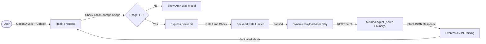

# 🧠 The TieBreaker

> **Stop guessing. Start deciding.** The mathematical AI engine for resolving your toughest "A vs B" dilemmas.


---

## 🚀 Overview

**The Problem:** When you ask ChatGPT or standard AI to choose between two things (like "MacBook vs iPad"), it usually spits out a huge, vague wall of text that says "it depends on your needs." That doesn't help you make a real decision! 

**Our Solution:** The TieBreaker forces an Azure AI Agent through a super strict pipeline. Instead of essays, it gives you exact math, structured comparison tables, pros/cons, and a final definitive winner based on your actual lifestyle and context.

---

## 📸 App Previews

### WelcomeModal

*A clean welcome screen explaining how the 3-step decision process works.*

### Tiebreaker (2nd impression)

*Enter your two contenders and drop in your personal context so the AI knows exactly what you care about.*

### theme change pic
.png)
*Toggle between light and dark modes because every great dev tool needs a gorgeous dark theme.*

### verdict

*No more "it depends"—you get a clear winner and the key takeaways.*

### free limit reached

*A beautiful paywall that blocks users and prompts them to create an account after 3 free decisions.*

---

## ✨ What Makes This Different? (USPs)

Instead of a standard chat box, the TieBreaker is highly structured:
* **No Chatbots:** You don't talk to the AI. You fill out a form, and it generates a dashboard.
* **Objective Comparisons:** It creates a rigid table comparing both options across the exact same factors.
* **Mathematical Padding:** If you only provide 1 comparison factor, the backend automatically calculates how many more it needs and injects smart defaults.
* **The "My Case" Context:** The AI doesn't give generic advice. It uses your specific constraints (like "I have a $1000 budget and I travel a lot").

---

## 🏗️ Architecture



---

## 🤖 Why Azure AI Foundry Agents?

Why not just use a simple OpenAI API key? Because we needed absolute reliability. Azure AI Foundry Agents let us lock down the AI's behavior. We don't want it to be "creative" or write markdown text. We need it to return a perfect JSON object every single time, without fail. Azure AI Foundry ensures the agent strictly obeys our system instructions.

---

## 🧠 Meet Melinda: The Decision Intelligence Engine

Melinda is the brain behind the TieBreaker, hosted entirely on Azure AI Foundry as an Agent.

**Melinda in Azure AI Foundry:**  
  
*(Azure agent setup preview)*

### How Melinda works:
1. **Reads your setup:** She takes "Option A" and "Option B".
2. **Weighs your context:** She applies your "My Case" rules.
3. **Generates the JSON:** She outputs the data in a strict contract.
4. **Cascades context:** When generating the final verdict, she only looks at the data from the previous tabs to ensure she doesn't hallucinate new facts!

### Her Output Structure
This is the strict JSON contract Melinda must follow:
```json
{
  "entities": ["MacBook Air M3", "iPad Pro M4"],
  "analyticalReasoning": "Given the user's focus on heavy video editing and multitasking, the MacBook offers a true desktop OS while the iPad is limited by iPadOS.",
  "factors": ["Usability", "Cost", "Performance", "Ecosystem"], 
  "comparison": [
    {
      "optionName": "MacBook Air M3",
      "values": {
        "Usability": "Full macOS with desktop-class multitasking.",
        "Cost": "Starting at $1099, excellent value.",
        "Performance": "M3 chip handles 4K video editing effortlessly.",
        "Ecosystem": "Seamless integration with iOS devices."
      }
    },
    {
      "optionName": "iPad Pro M4",
      "values": {
        "Usability": "Touch-first iPadOS, limited multitasking.",
        "Cost": "Starting at $999, but requires $299 Magic Keyboard.",
        "Performance": "Incredibly fast M4, but bottlenecked by software.",
        "Ecosystem": "Excellent for Apple Pencil drawing and media consumption."
      }
    }
  ]
}
```

### Validation Benefits
* Prevents UI layout shifts
* Eliminates incomplete table columns
* Reduces hallucinated pricing and specs
* Ensures predictable component rendering

---

## 🎯 Key Features

### Mathematical Factor Padding
If a user provides only 1 comparison factor, the backend dynamically calculates the deficit and injects universal baseline dimensions to complete the UI grid.

### "My Case" Context Engine
Allows users to input up to 500 words of specific constraints (budget, use case, lifestyle). Melinda uses this data to break ties definitively, ensuring the "Verdict" isn't generic, but hyper-personalized to the user's situation.

### Context Cascading
The Final Verdict isn't generated in a vacuum. The frontend harvests previously generated matrices and injects them back into the backend payload so Melinda synthesizes a decision based *only* on prior factual data.

---

## 🔒 Security & Reliability

| Concern | Protection |
| --- | --- |
| Excessive API Costs | Input `maxLength` enforcement & 500-word constraint on Context |
| Rate Limit Exhaustion | Express rate limiter (`express-rate-limit`) |
| Broken Tables/UI | JSON parsing interceptors & regex sanitization |
| Outdated Data | Live Web Grounding (Optional Toggle) |

---

## ⚙️ Technology Stack

| Layer | Technology |
| --- | --- |
| **Frontend** | React 19, Vite, Tailwind CSS v4, Framer Motion |
| **Backend** | Node.js, Express |
| **AI Platform** | Azure AI Foundry |
| **Agent Auth** | `@azure/identity` (`AzureCliCredential`) |
| **Language** | TypeScript / JavaScript |

---

## 🧪 Test Results

We wrote an automated test suite to make sure the app never breaks. We have 9/9 passing tests checking everything from dark mode toggling to AI API error handling!


---

## 🚀 Quick Start

### 1. Clone Repository
```bash
git clone https://github.com/Ahtesham-Latif/Tie-Breaker-App.git
cd Tie-Breaker-App
```

### 2. Install Dependencies
```bash
npm install
```

### 3. Configure Environment Variables
Create a `.env` file in the root directory:
```env
FOUNDRY_ENDPOINT=https://your-agent.services.ai.azure.com/openai/deployments/gpt-4o/chat/completions?api-version=2025-05-15-preview
Melinda_Agent=your-agent-identifier
```

### 4. Authenticate with Azure
```bash
az login
```

### 5. Start Development Server
Run the Vite frontend and Express server concurrently:
```bash
npm run dev:full
```

---

## 📂 Project Structure

```text
root/
├── server.js            # Express API, REST proxy, JSON Sanitization
├── TieBreaker_Agent_Prompt.md # System Prompt & JSON schemas
├── package.json         # Concurrently, Vite, Tailwind
├── src/
│   ├── App.tsx          # Dual-input UI, Context Cascading, and LRU Cache
│   ├── main.tsx         # React entry point
│   ├── index.css        # Tailwind directives
│   └── lib/
│       └── utils.ts     # Class merging utilities
├── Pictures/
├── .env.example
└── README.md
```

---

## 🏆 Google Gemini CLI Usage

The Google Gemini CLI (Agent) was used throughout development to accelerate engineering workflows and architect robust system components.

### Contributions
* Component scaffolding and dynamic React state management
* Tailwind CSS UI/UX implementation
* Express middleware and direct REST API orchestration
* Robust RegEx sanitization pipelines for LLM JSON outputs
* Azure Identity SDK (`@azure/identity`) integration support

### Verified Achievement
**Build AI Agents with Gemini**
[](https://developers.google.com/profile/badges/events/cloud/five-day-ai-agents)

---

## 🔮 Future Enhancements
* User Authentication and Database implementation via Supabase
* Persistent knowledge/decision history
* PDF export for Decision Matrices
* Social sharing for specific dilemmas

---

## 🤝 Contributing

Contributions are welcome. Please ensure that any prompt engineering modifications adhere strictly to the philosophy of **"Deterministic structure over free-form AI output"** and respect the negative constraints in `server.js`.

---

## 📄 License

MIT License

---

## 👨💻 Author

**Ahtesham Latif**
Business & IT Student
University of the Punjab (IBIT)
[LinkedIn](https://www.linkedin.com/in/ahtesham-latif) | [Google Developer Profile](https://me.developers.google.com/u/me)

*"Turning subjective dilemmas into objective, fact-driven decisions."*
