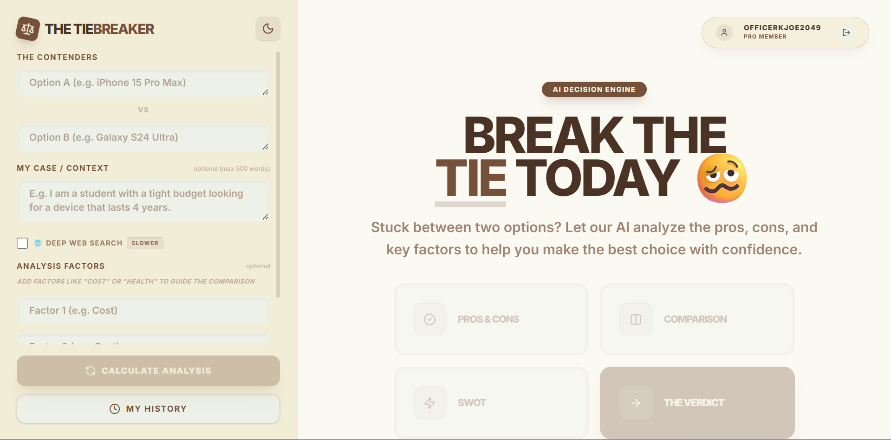

# 🧠 The TieBreaker

> **Stop guessing. Start deciding.** A deterministic AI decision engine that transforms ambiguous "A vs B" dilemmas into structured comparison matrices, multi-angle analysis, and context-aware verdicts.


---

## 🚀 Overview

When users ask general-purpose AI to choose between two options—for example, *“MacBook Air vs iPad Pro”*—the response is typically an open-ended, markdown-heavy wall of text concluding with *"it depends on your needs."* While comprehensive, it fails to deliver a structured, actionable decision framework.

**The TieBreaker** operates on the opposite philosophy: **deterministic structure over free-form AI conversation**.

Instead of a chat interface, it enforces a strict backend execution pipeline. Users submit two contenders along with optional personal constraints and evaluation factors. The system processes the input through a schema-driven AI engine, rendering a multi-tab analytical dashboard featuring objective comparison matrices, SWOT profiles, and a definitive, context-grounded winner.

With the integration of **Supabase**, The TieBreaker extends from a session-based utility into a persistent cloud platform. Authenticated users can securely save and manage their past decisions.

---

## 📸 Application Previews

### The Tiebreaker Engine

*Dual-input fields alongside the 500-word constraint personalized context input engine.*

### Authenticated Cloud State

*Adaptive layout for authenticated users, featuring a dedicated "My History" panel to retrieve cloud-synced matrices.*

---

## ✨ What Makes This Different?

Most AI tools generate conversational text. The TieBreaker generates **structured data**.

Every dilemma is transformed into a structured decision artifact:
* Objective Comparison Matrices
* Fact-based Pros & Cons
* SWOT Profiles
* Final Verdicts tailored exactly to the user's "My Case" context
* Persistent Cloud History for authenticated users

The result is a decision-first experience designed for action rather than endless conversation.

---

## 🏗️ Architecture

```mermaid
flowchart LR
    %% =========================
    %% Client Layer
    %% =========================
    U[User]
    FE[React Frontend]
    UI[Decision Dashboard UI]
    LS[(Local Cache / Session State)]

    U -->|Enter Option A vs B, Factors, My Case| FE
    FE -->|Render results, tabs, verdict views| UI
    FE <-->|Cache reads / repeat session checks| LS

    %% =========================
    %% Identity + Persistence
    %% =========================
    SB[(Supabase Auth + Postgres)]
    FE <-->|Auth session, fetch history, save decisions| SB

    %% =========================
    %% Client Access Control
    %% =========================
    FE --> G{Authenticated?}
    G -- Yes --> API
    G -- No --> L{Free local usage remaining?}
    L -- Yes --> API
    L -- No --> WALL[Show Auth Wall / Upgrade Prompt]

    %% =========================
    %% Backend Orchestration
    %% =========================
    API[Express API Gateway]

    subgraph BACKEND[Backend Orchestration Layer]
        RL[Rate Limiter]
        NORM[Input Validation + Normalization]
        PAD[Factor Padding + Payload Assembly]
        AIREQ[AI Request Builder]
        SAN[Response Sanitization]
        VAL[Schema Validation]
    end

    API --> RL
    RL --> NORM
    NORM --> PAD
    PAD --> AIREQ

    %% =========================
    %% AI Decision Layer
    %% =========================
    subgraph AI[Melinda Decision Engine - Azure AI Foundry]
        MEL[Structured Decision Agent]
        WEB[Optional Live Web Grounding]
    end

    AIREQ --> MEL
    MEL <-->|Optional retrieval for current facts| WEB
    MEL -->|Structured JSON decision payload| SAN

    %% =========================
    %% Contract Enforcement
    %% =========================
    SAN --> VAL
    VAL -->|Validated decision artifact| API

    %% =========================
    %% Return + Persistence
    %% =========================
    API -->|Comparison matrix, SWOT, verdict, reasoning| FE
    FE -->|Persist authenticated decision history| SB
```



### Staged Processing Pipeline
1. **Ingestion & Normalization:** Captures inputs, enforces length boundaries (`maxLength`), and normalizes strings.
2. **Deterministic Fallback Padding:** Analyzes requested factors and automatically injects universal baseline dimensions if data is sparse.
3. **Structured Orchestration:** Dispatches a structured schema instruction set via REST to the hosted Azure AI Agent.
4. **Sanitization Interceptor:** Sanitizes raw LLM output strings via RegEx, parses the JSON payload, and validates it against the expected UI schema before returning it to the client.
5. **Persistence & Authentication:** Leverages Supabase to authenticate users and securely store generated decision matrices in a cloud database for instant historical retrieval.

---

## 🤖 Why Azure AI Foundry Agents?

Melinda was engineered as an Azure AI Foundry Agent instead of a standard completion endpoint to enforce strict execution constraints over a probabilistic model. 

The TieBreaker relies heavily on:
* **Live Web Grounding (Bing Search Tool):** Access to real-time tools ensures Melinda evaluates current market prices, volatile tech specs, and modern product configurations rather than relying on stale training data.
* **Low Volatility (0.3 Temperature):** A strict `0.3` temperature setting prevents hallucinated product specifications, ensuring objective and repeatable data artifacts.
* **Enterprise Guardrails:** Azure content safety filters ensure that inappropriate or malformed requests are categorically blocked before compute resources are wasted or bad data enters the Supabase ecosystem.
* **Schema Enforced Output:** Standard conversational APIs are prone to markdown bleed and formatting hallucinations. By enforcing structured output at the agent level, we lock down a strict JSON contract that guarantees the React frontend never encounters a layout shift or broken table.

---

## 🧠 Meet Melinda: The Decision Intelligence Engine

The backend brain of TieBreaker is **Melinda**, an isolated agent hosted on Azure AI Foundry. Her single responsibility is converting unstructured human dilemmas into a strictly typed data artifact.

### Expected JSON Output Contract
Every response must strictly match this schema layout to satisfy the frontend parser:

```json
{
  "entities": ["MacBook Air M3", "iPad Pro M4"],
  "analyticalReasoning": "Given the user's focus on heavy video editing...",
  "factors": ["Usability", "Cost", "Performance", "Ecosystem"],
  "comparison": [
    {
      "optionName": "MacBook Air M3",
      "values": {
        "Usability": "Full macOS with desktop-class multitasking."
      }
    }
  ]
}
```

---

## 🎯 Key Features

### Cloud Identity & History Persistence
* **Authentication:** Integrated Supabase GoTrue Auth with background blur modal.
* **Data Persistence:** Decisions are securely saved to a Supabase PostgreSQL database.
* **Adaptive UI States:** Layouts dynamically collapse and expand based on authentication status.

### AI Decision Engine
* **No Chatbot UX:** Form-driven data dashboard components.
* **"My Case" Context Engine:** Personalized analysis tailored to 500-word user constraints.
* **Multi-Lens Analytical Views:** Pros & Cons, Comparison Matrices, SWOT, and Final Verdicts.
### 🧠 Intelligent Cache Orchestration
The TieBreaker features a highly optimized, two-tier caching mechanism to protect API quotas and ensure instant data retrieval:
* **Local LRU Cache:** An in-memory cache instantly returns previously generated tabs during a single session.
* **Supabase History Pre-population:** When a user clicks a past decision, the backend fetches the JSON payload and pre-populates the local cache *only* for the tabs they actually generated, preventing blank screens or cache poisoning.
* **Case-Insensitive DB Fallback:** If the local cache misses, a case-insensitive `.ilike()` fallback query checks the cloud database before ever triggering the Azure AI engine, ensuring users aren't charged for slightly miscapitalized queries.
* **Smart Auto-Selection:** History items intelligently scan their payload and automatically select the first valid analysis tab, guaranteeing the user never lands on an empty screen.

### Interface Design
* **Premium Fluid AI Loading Orb:** Replaces boring loading spinners with a state-of-the-art, liquid Apple/OpenAI-style continuous progress animation driven by `requestAnimationFrame`.
* **Zero-Scroll Mobile Engine:** Side-by-side data grids optimized with compact padding and a fixed micro-toolbar.
* **Theme Adaptability:** Full dark/light structural synchronization across all customized components.

### UX Messaging Architecture
* **Emotionally Intelligent Feedback:** System boundaries (rate limits, Azure quota exhaustion, auth walls, and 15-tie database limits) are handled by a centralized messaging layer ensuring a calm, premium, and reassuring tone rather than injecting raw markdown.
* **Zero Technical Bleed:** Backend errors and JSON parsing failures are elegantly abstracted. Users receive actionable, clear guidance without ever seeing raw stack traces or internal agent details.

---

## 🔒 Security & Reliability

| Concern | Protection | Implementation Layer |
| --- | --- | --- |
| **Excessive API Compute Costs** | String length boundaries & 500-word payload enforcement | Frontend Input & Express Router |
| **Rate Limit / API Exhaustion** | Cluster rate limiting via `express-rate-limit` middleware | Node.js Server Ingestion |
| **Broken UI / Layout Collapse** | Regex structural parsing interceptors & schema key validations | Express Response Pipe |
| **Anonymous Spam** | Local storage-tracked client block prompting account initialization after 3 free inquiries | React Frontend |
| **Free-Tier Abuse** | Hardcoded 15-tie limit enforced via Supabase triggers | Database & Frontend |

### API Rate Limiting & Cooldowns
* **Server Limit:** 5 requests per IP every 15 minutes.
* **Frontend Cooldown:** Strict 10-second penalty blocks on API failures (e.g. Quota Exceeded) that automatically clear themselves, preventing users from spamming the "Analyze" button.

### Validation & Resiliency Checks
* **Structured AI Formatting:** Pre-hydration regex parsers repair markdown bleed and enforce strict JSON shape.
* **Schema Contract Compliance:** Express explicitly guarantees backend structure before payload delivery to React.
* **Input Enforcement:** Hard truncation constraints prevent massive unstructured uploads from crashing prompt generation.
* **Fallback Matrix Padding:** Node dynamically injects default properties if the AI returns sparse rows, preventing UI grid collapse.

---


## ⚙️ Technology Stack

| Layer | Technology |
| --- | --- |
| **Frontend** | React 19, Vite, Tailwind CSS v4, Framer Motion |
| **Backend** | Node.js, Express |
| **Database & Auth**| Supabase (PostgreSQL, GoTrue Auth) |
| **AI Platform** | Azure AI Foundry, `@azure/identity` |
| **Language** | TypeScript |
| **Testing** | Vitest |

---

## 🧪 Testing & Quality Assurance

The TieBreaker incorporates targeted component test suites (`App.test.jsx`) to verify interface stability, state persistence, and error mitigation vectors.

### Core Testing Priorities
* **Component Render Stability:** Verifying the multi-lens dashboard layout maintains layout stability regardless of missing AI matrix factors.
* **Auth & Gate Logic:** Validating the strict lock-out mechanisms for users who exhaust the free tier, ensuring the local storage triggers align perfectly with the React state.
* **State Management:** Guaranteeing theme toggling (Dark/Light) and caching layers seamlessly persist across intense UI state changes.

---

## 🚀 Quick Start

### 1. Clone & Navigate
```bash
git clone https://github.com/Ahtesham-Latif/Tie-Breaker-App.git
cd Tie-Breaker-App
```

### 2. Install Dependencies
```bash
npm install
```

### 3. Configure Environment Variables
```bash
cp .env.example .env
```
Populate `.env` with:
```env
FOUNDRY_ENDPOINT=https://your-agent.services.ai.azure.com/openai/deployments/gpt-4o/chat/completions?api-version=2025-05-15-preview
Melinda_Agent=your-agent-identifier
VITE_SUPABASE_URL=your-supabase-url
VITE_SUPABASE_ANON_KEY=your-supabase-anon-key
```

### 4. Authenticate Infrastructure
```bash
az login
```

### 5. Launch Local Dev Node
Execute frontend and backend tasks concurrently:
```bash
npm run dev:full
```

---

## 🏆 Google Gemini CLI Workflows

The **Google Gemini CLI** was utilized as an engineering accelerator throughout development to bootstrap system components and refine backend safety configurations.

### Contributions
* Structuring the React interface and Zero-Scroll mobile layout
* Integrating Supabase authentication and PostgreSQL history tracking
* Implementing strict regex sanitizers to parse corrupted JSON output blocks
* Structuring automated UI and integration testing patterns inside Vitest

### Verified Badges
**Build AI Agents with Gemini**
[](https://developers.google.com/profile/badges/events/cloud/five-day-ai-agents)

---

## 🔮 Future Enhancements
* Develop a backend layout engine to support **PDF Export** for completed decision matrices.
* Introduce cryptographically unique shareable links for cross-user scenario exploration.
* Build advanced surveying modules to capture user feedback on engine accuracy.

---

## 🤝 Contributing
Contributions, suggestions, and feedback are welcome.
1. Fork the repository
2. Create a feature branch
3. Commit your changes
4. Open a pull request

---

## 📄 License
MIT License

---

## 👨‍💻 Author

**Ahtesham Latif**  
*Business & IT Scholar — University of the Punjab (IBIT)*  
[LinkedIn](https://www.linkedin.com/in/ahtesham-latif) | [Google Developer Profile](https://me.developers.google.com/u/me)  

*"Turning subjective dilemmas into objective, fact-driven choices through deterministic software architecture."*